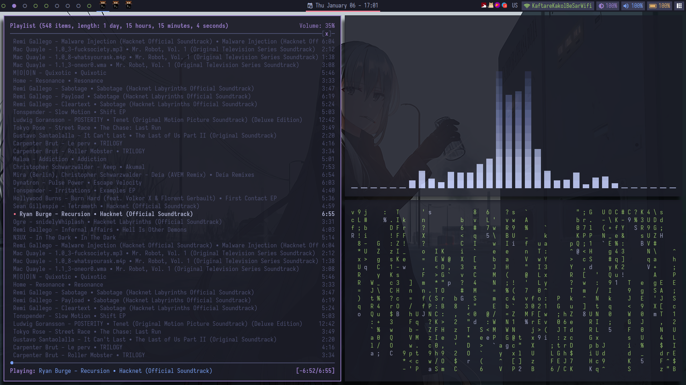

<!-- Made by Nexn with VIM :) -->

  

    

        
        
        
    

There is no place like <strong>$HOME</strong>

---

## Table of Contents
- [Current setup](#screenshot)
- [What are dotfiles](#dotfile-explain)
- [How To Manage Your Own Dotfiles](#manage-dotfiles)
- [License](#license)

<h2 id="screenshot">Current Setup<h2>

<h3 id="screenshot">FAQ</h3>

- Colorscheme: Tokyonight
- Fonts:
    - iosevka
    - Open Sans Pro
    - hack nerd font
    - Font awesome
- Terminal: Kitty
- Icon theme: Arc
- Browser: Brave (why not firefox!? cuz its slow)
- WM: AwesomeWM

<h2 id="dotfile-explain">What Are Dotfiles?</h2>

Dotfiles are the customization files that are used to personalize your Linux or
other Unix-based system.  You can tell that a file is a dotfile because the name
of the file will begin with a period--a dot!  The period at the beginning of a
filename or directory name indicates that it is a hidden file or directory.

This repository contains my personal dotfiles. They are stored here for convenience so
that I may quickly access them on new machines or new installs.  Also, others may find
some of my configurations helpful in customizing their own dotfiles.

<h2 id="manage-dotfiles">How To Manage Your Own Dotfiles?</h2>

There are a hundred ways to manage your dotfiles. Personally, I use the *git bare
repository method* for managing my dotfiles. Here is an article about this method
of managing your dotfiles: [Article Link](https://developer.atlassian.com/blog/2016/02/best-way-to-store-dotfiles-git-bare-repo/)

<h2 id="license">License</h2>

The files and scripts in this repository are licensed under the MIT License, which
is a very permissive license allowing you to use, modify, copy, distribute, sell,
give away, etc. the software. In other words, do what you want with it. The only
requirement with the MIT License is that the license and copyright notice must be
provided with the software.

#### [License link](./LICENSE.txt)

